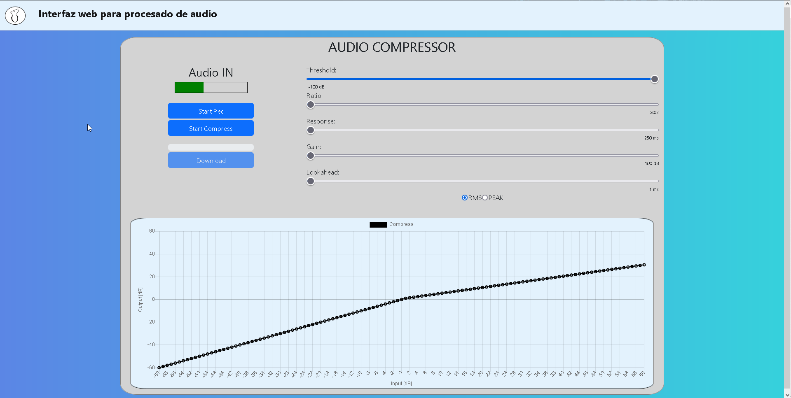
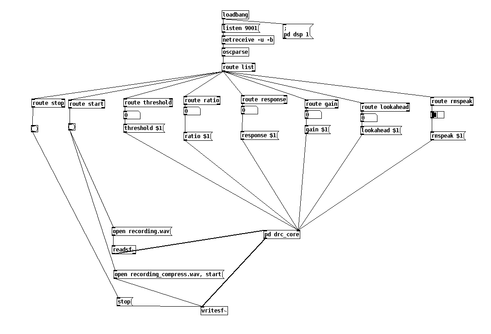
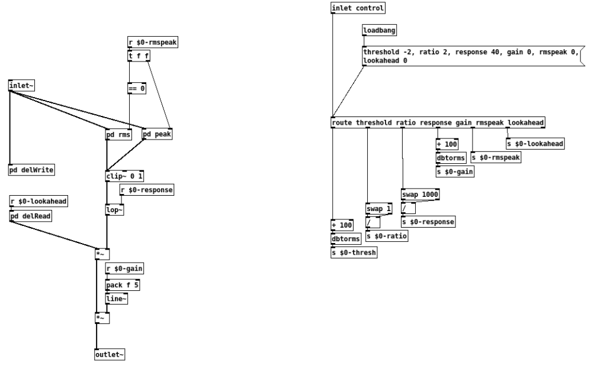

<h1>Project for Bachelor's Thesis in Electronic Engineering</h1>

The present work displays a project which involves the programming of a web interface
that gives access to the controls of an audio signal processor: basic
audio compressor.

<h2>Visual of web interface</h2>

<h2>Connection and control of Audio Compressor (DRC) in Puredata</h2>

<h2>Audio Compressor (DRC) in Puredata</h2>

